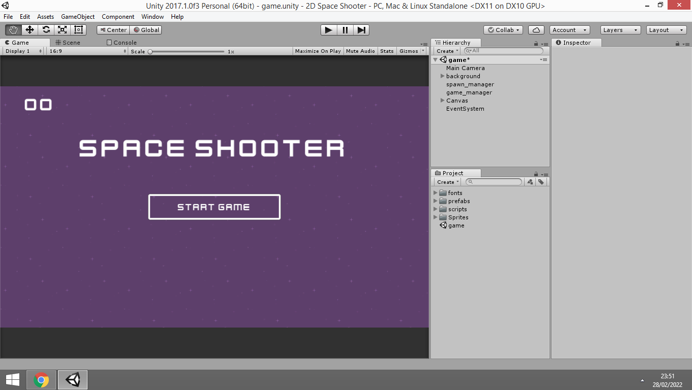
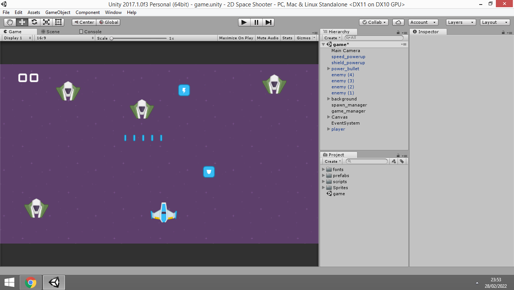

## Unity 3D - 2D Space Shooter Clone :

 Simple 2D Space Shooter Clone built with Unity 3D and C#
 
## Project Content :

 - Collision with gameobjects system by gameobjects tag names
 - Instantiation of prefabs
 - Communication between scripts
 - Enemies and powerups spawn system
 - UI management system
 - Work with Coroutines
 - Powerups system ( speedboost - powershoot - shiled )
 - 2D spaceship movement system

## Project Assets :

 All project assets from <a href="https://www.kenney.nl/" target="_blank">Kenney.nl</a> website for free games assets .

## Unity 3D Verion :

Unity 3D 2017.1

## Preview :

